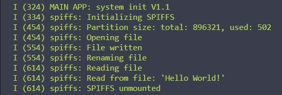

# SPIFFS教程

本教程旨在介绍SPIFFS（SPI Flash File System，SPI闪存文件系统）的基本概念和使用方法。通过本教程，你将了解到如何在ESP32上配置和使用SPIFFS，进行基本的文件操作。

## 学习目标

- 理解SPIFFS的基础概念和作用
- 学会在ESP32上配置和使用SPIFFS。
- 掌握基本的文件操作，如创建、读取、写入和删除文件。

## 学习资源

- 示例代码：[Github仓库链接](main/src/fs/ds_spiffs.c)
- esp-idf参考资料：[SPIFFS文档](https://docs.espressif.com/projects/esp-idf/zh_CN/release-v4.1/api-reference/storage/spiffs.html)

## 学习内容

### 什么是SPIFFS
简单介绍SPIFFS的基本概念，它是一个针对SPI NOR闪存设备的轻量级文件系统，为嵌入式系统提供了简单的文件存储和操作功能。

### ESP32的SPIFFS示例
通过示例代码，学习如何在ESP32上配置和使用SPIFFS，进行基本的文件操作。

#### 初始化SPIFFS
在使用SPIFFS之前，首先需要进行初始化。初始化过程包括注册SPIFFS文件系统、设置基本路径和分区标签等。下面是初始化SPIFFS的示例代码：
~~~c
#include "esp_spiffs.h"
#include "esp_log.h"

static const char *TAG="spiffs";

esp_vfs_spiffs_conf_t conf = {
      .base_path = "/spiffs",
      .partition_label = NULL,
      .max_files = 5,
      .format_if_mount_failed = true
};

esp_err_t init_spiffs(void)
{
    ESP_LOGI(TAG, "Initializing SPIFFS");

    esp_err_t ret = esp_vfs_spiffs_register(&conf);
    if (ret != ESP_OK) {
        if (ret == ESP_FAIL) {
            ESP_LOGE(TAG, "Failed to mount or format filesystem");
        } else if (ret == ESP_ERR_NOT_FOUND) {
            ESP_LOGE(TAG, "Failed to find SPIFFS partition");
        } else {
            ESP_LOGE(TAG, "Failed to initialize SPIFFS (%s)", esp_err_to_name(ret));
        }
        return ESP_FAIL;
    }

    size_t total = 0, used = 0;
    ret = esp_spiffs_info(NULL, &total, &used);
    if (ret != ESP_OK) {
        ESP_LOGE(TAG, "Failed to get SPIFFS partition information (%s)", esp_err_to_name(ret));
        return ESP_FAIL;
    }

    ESP_LOGI(TAG, "Partition size: total: %d, used: %d", total, used);
    return ESP_OK;
}
~~~
在上述代码中：
- 我们首先定义了一个esp_vfs_spiffs_conf_t类型的变量conf，并设置了基本路径、分区标签、最大文件数和格式化选项。
- 然后，我们创建了一个init_spiffs函数来初始化SPIFFS。在该函数内，我们使用esp_vfs_spiffs_register函数注册SPIFFS文件系统。
- 我们还检查了返回值以确保SPIFFS已成功初始化，并使用esp_spiffs_info函数获取了SPIFFS分区的总容量和已用容量。

#### 基本的文件操作
在SPIFFS初始化完成后，我们就可以进行文件操作了。以下是基本的文件操作示例，包括创建文件、写入数据、读取数据和删除文件：
~~~c
void ds_spiffs_test(){
    // 创建文件
    ESP_LOGI(TAG, "Opening file");
    FILE* f = fopen("/spiffs/hello.txt", "w");
    if (f == NULL) {
        ESP_LOGE(TAG, "Failed to open file for writing");
        return;
    }
    fprintf(f, "Hello World!\n");
    fclose(f);
    ESP_LOGI(TAG, "File written");

    // 检查目标文件是否存在，如果存在则删除
    struct stat st;
    if (stat("/spiffs/foo.txt", &st) == 0) {
        unlink("/spiffs/foo.txt");
    }

    // 重命名文件
    ESP_LOGI(TAG, "Renaming file");
    if (rename("/spiffs/hello.txt", "/spiffs/foo.txt") != 0) {
        ESP_LOGE(TAG, "Rename failed");
        return;
    }

    // 读取文件
    ESP_LOGI(TAG, "Reading file");
    f = fopen("/spiffs/foo.txt", "r");
    if (f == NULL) {
        ESP_LOGE(TAG, "Failed to open file for reading");
        return;
    }
    char line[64];
    fgets(line, sizeof(line), f);
    fclose(f);
    // 去除换行符
    char* pos = strchr(line, '\n');
    if (pos) {
        *pos = '\0';
    }
    ESP_LOGI(TAG, "Read from file: '%s'", line);
}
~~~
在上述代码中，我们演示了如何：
- 使用fopen函数创建和打开文件；
- 使用fprintf函数写入数据；
- 使用fclose函数关闭文件；
- 使用stat函数检查文件是否存在；
- 使用unlink函数删除文件；
- 使用rename函数重命名文件；
- 使用fgets函数读取数据。

#### 结束使用
在不再需要SPIFFS时，我们应该卸载它以释放系统资源。以下是卸载SPIFFS的示例代码：
~~~c
void ds_spiffs_deinit(){
    // 卸载分区并禁用SPIFFS
    esp_vfs_spiffs_unregister(conf.partition_label);
    ESP_LOGI(TAG, "SPIFFS unmounted");
}
~~~

#### 示例代码效果

  
在上述代码中，我们使用esp_vfs_spiffs_unregister函数卸载了SPIFFS分区，并通过日志消息确认了该操作。

### SPIFFS API介绍

在ESP_spiffs.h中定义了一些重要的API，它们为我们提供了在ESP32上配置和使用SPIFFS的必要工具。这些API包括：

#### esp_vfs_spiffs_conf_t 结构体

- 这是一个配置结构体，用于在注册SPIFFS时传递配置参数。
- 包括基础路径、分区标签、最大可打开的文件数以及如果挂载失败是否格式化文件系统的选项。
~~~c
typedef struct {
        const char* base_path;
        const char* partition_label;
        size_t max_files;
        bool format_if_mount_failed;
} esp_vfs_spiffs_conf_t;
~~~
- base_path：文件路径前缀，与文件系统相关联。
- partition_label：SPIFFS分区的标签。如果设置为NULL，将使用第一个subtype为spiffs的分区。
- max_files：同时可以打开的最大文件数。
- format_if_mount_failed：如果为true，则在挂载失败时格式化文件系统。

#### esp_vfs_spiffs_register 函数

- 此函数用于注册并挂载SPIFFS到VFS（虚拟文件系统）。
- 返回ESP_OK表示成功，其他错误代码表示失败。
~~~c
esp_err_t esp_vfs_spiffs_register(const esp_vfs_spiffs_conf_t * conf);
~~~
- conf：指向esp_vfs_spiffs_conf_t配置结构的指针。

#### esp_vfs_spiffs_unregister 函数

- 用于取消注册并卸载从VFS的SPIFFS。
- 返回ESP_OK表示成功，ESP_ERR_INVALID_STATE表示已经取消注册。
~~~c
esp_err_t esp_vfs_spiffs_unregister(const char* partition_label);
~~~
- partition_label：与esp_vfs_spiffs_register函数中传递的分区标签相同。

#### esp_spiffs_mounted 函数

- 检查SPIFFS是否已挂载。
- 返回true表示已挂载，false表示未挂载。

~~~c
bool esp_spiffs_mounted(const char* partition_label);
~~~
- partition_label：分区标签的可选项。如果未指定，将使用第一个subtype为spiffs的分区。

#### esp_spiffs_format 函数

- 格式化SPIFFS分区。
- 返回ESP_OK表示成功，ESP_FAIL表示失败。

~~~c
esp_err_t esp_spiffs_format(const char* partition_label);
~~~
- partition_label：与esp_vfs_spiffs_register函数中传递的分区标签相同。

#### esp_spiffs_info 函数

- 获取SPIFFS的信息，包括文件系统的大小和当前使用的字节数。
- 返回ESP_OK表示成功，ESP_ERR_INVALID_STATE表示未挂载。

~~~c
esp_err_t esp_spiffs_info(const char* partition_label, size_t *total_bytes, size_t *used_bytes);
~~~
- partition_label：与esp_vfs_spiffs_register函数中传递的分区标签相同。
- total_bytes：指向保存文件系统大小的变量的指针。
- used_bytes：指向保存当前在文件系统中使用的字节数的变量的指针。

#### esp_spiffs_check 函数

- 检查SPIFFS的完整性。
- 返回ESP_OK表示成功，ESP_ERR_INVALID_STATE表示未挂载，ESP_FAIL表示错误。
~~~c
esp_err_t esp_spiffs_check(const char* partition_label);
~~~
- partition_label：与esp_vfs_spiffs_register函数中传递的分区标签相同。

这些函数提供了对SPIFFS的基本操作，包括注册、卸载、格式化、获取信息以及检查完整性等，为开发者提供了方便快捷的文件系统操作接口。

## 获取帮助

如果您遇到任何问题或需要帮助，请随时在与此仓库关联的 GitHub 问题跟踪器中提出问题。

## 许可和贡献

本项目遵循MIT许可协议。对于原课程的所有内容，请参考原课程的许可证规定。

[查看原课程的 MIT 许可证](LICENSE)
