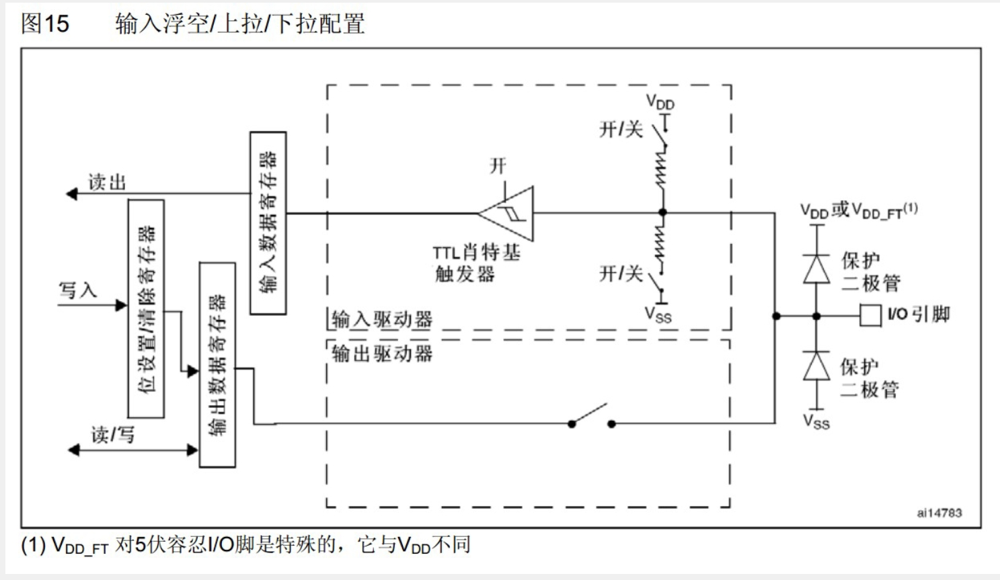
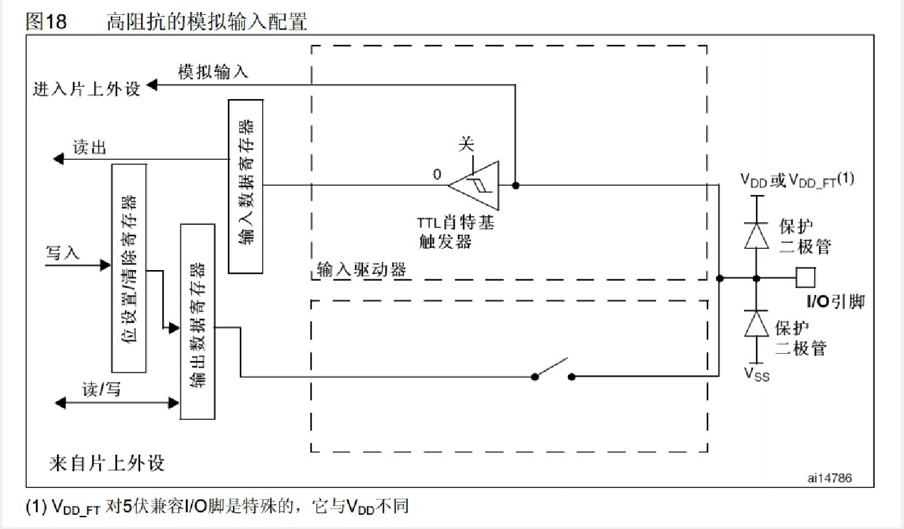
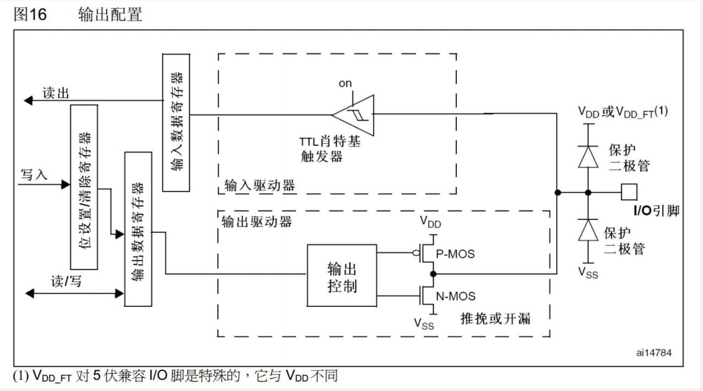
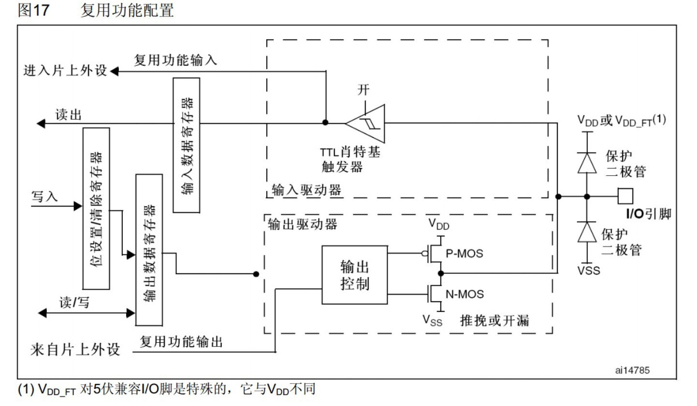

# GPIO专业版

## GPIO模式和配置

### GPIO模式

#### 浮空模式 (Floating Mode):

- 在浮空模式下，GPIO引脚没有连接到任何电源或地，它既不是高电平也不是低电平。浮空的GPIO引脚容易受到外部电磁干扰，因此通常不建议在实际应用中使用浮空模式。

#### 上拉模式 (Pull-up Mode):

- 在上拉模式下，GPIO引脚通过内部或外部的上拉电阻连接到电源，确保在没有外部信号时引脚保持高电平。

#### 下拉模式 (Pull-down Mode):

- 在下拉模式下，GPIO引脚通过内部或外部的下拉电阻连接到地，确保在没有外部信号时引脚保持低电平。

#### 模拟模式 (Analog Mode):

- 在模拟模式下，GPIO引脚可以处理模拟信号，通常与模拟数字转换器(ADC)或数字模拟转换器(DAC)配合使用。

#### 开漏模式 (Open-drain Mode):

- 在开漏模式下，GPIO引脚可以输出低电平或保持浮空。当输出低电平时，它连接到地，当浮空时，它不驱动任何电平，通常需要一个外部上拉电阻来保证逻辑高电平。

#### 推挽模式 (Push-pull Mode):

- 在推挽模式下，GPIO引脚可以输出高电平或低电平，它可以向电源或地方向驱动电流。

#### 复用开漏模式 (Alternate Open-drain Mode):

在复用开漏模式下，GPIO引脚作为开漏输出，同时也可以被配置为具有特定外设功能的引脚，例如I2C的数据线。

#### 复用推挽模式 (Alternate Push-pull Mode):

在复用推挽模式下，GPIO引脚作为推挽输出，同时也可以被配置为具有特定外设功能的引脚，例如SPI的数据线。、

#### 中断模式 (Interrupt Mode):

在中断模式下，GPIO引脚的电平变化可以触发中断，允许程序在特定事件发生时得到通知。

#### GPIO配置流程
流程图可以清晰地展示GPIO从配置到操作的整个过程。配置包括设置模式、中断类型、上拉/下拉等，而操作包括读写状态或处理中断。

## 使用标准库配置GPIO

### STM32

STM32提供了HAL/LL（硬件抽象层/低级库）来简化GPIO的配置和控制。例如，使用HAL库配置一个输出引脚可以是这样的：

~~~c
GPIO_InitTypeDef GPIO_InitStruct = {0};

__HAL_RCC_GPIOA_CLK_ENABLE();

GPIO_InitStruct.Pin = GPIO_PIN_5;
GPIO_InitStruct.Mode = GPIO_MODE_OUTPUT_PP;
GPIO_InitStruct.Pull = GPIO_NOPULL;
GPIO_InitStruct.Speed = GPIO_SPEED_FREQ_LOW;
HAL_GPIO_Init(GPIOA, &GPIO_InitStruct);

HAL_GPIO_WritePin(GPIOA, GPIO_PIN_5, GPIO_PIN_SET);
~~~
### ESP32
ESP32的driver/gpio.h库提供了一组简单的API来配置和控制GPIO。例如，配置GPIO为输出并设置电平可以是这样的：

~~~c
gpio_config_t io_conf = {
    .pin_bit_mask = (1ULL<<GPIO_NUM_2),
    .mode = GPIO_MODE_OUTPUT,
};
gpio_config(&io_conf);

gpio_set_level(GPIO_NUM_2, 1);
~~~

### 中断和事件处理
中断是一种有效的事件处理机制。当GPIO引脚的状态发生变化时，可以触发中断，并在中断服务例程（ISR）中处理事件。

例如，在ESP32上配置GPIO中断并处理可以是这样的：

~~~c
static void IRAM_ATTR gpio_isr_handler(void* arg) {
    // 中断处理代码
}

void setup() {
    gpio_config_t io_conf = {
        .pin_bit_mask = (1ULL<<GPIO_NUM_2),
        .mode = GPIO_MODE_INPUT,
        .intr_type = GPIO_PIN_INTR_ANYEDGE,
    };
    gpio_config(&io_conf);

    gpio_install_isr_service(0);
    gpio_isr_handler_add(GPIO_NUM_2, gpio_isr_handler, (void*) GPIO_NUM_2);
}
~~~
## 理解GPIO编程背后的原理
编写高效、可维护的GPIO代码需要理解底层硬件和操作系统的交互。例如，了解中断的工作机制，以及如何在中断服务例程中正确处理事件，可以避免许多常见的错误。

### 原则和最佳实践：
1. 最小化中断服务例程的执行时间：快速完成中断处理并返回，以避免影响其他系统活动。
2. 避免在中断服务例程中调用可能阻塞的函数：例如，避免在ISR中进行串口打印或等待同步原语。
3. 合理组织代码：通过合理的模块划分和函数封装，使代码结构清晰，易于维护和扩展。
4. 使用平台提供的库和工具：利用标准库和工具可以简化代码，减少错误，提高开发效率。