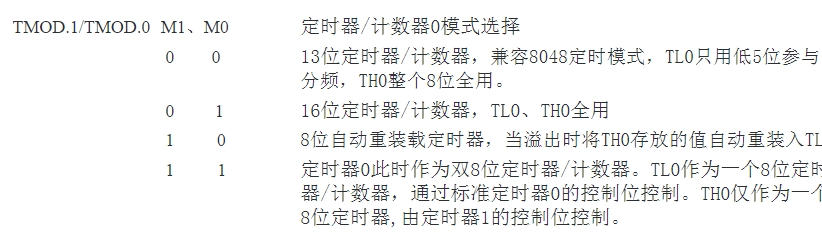
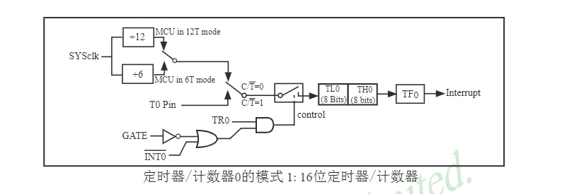
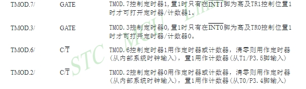
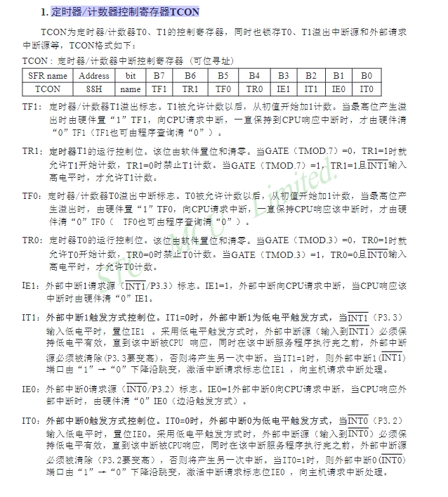
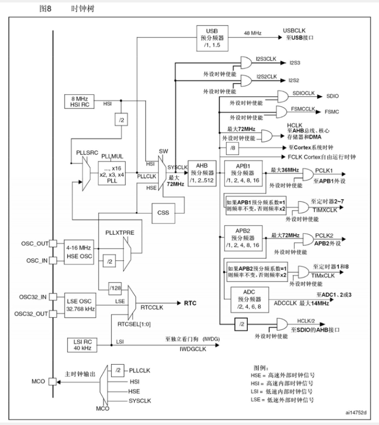
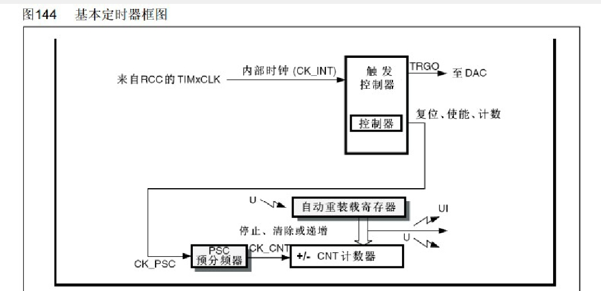
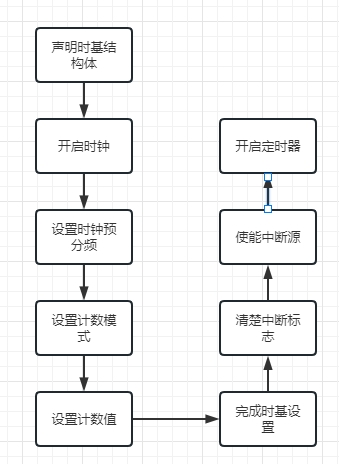
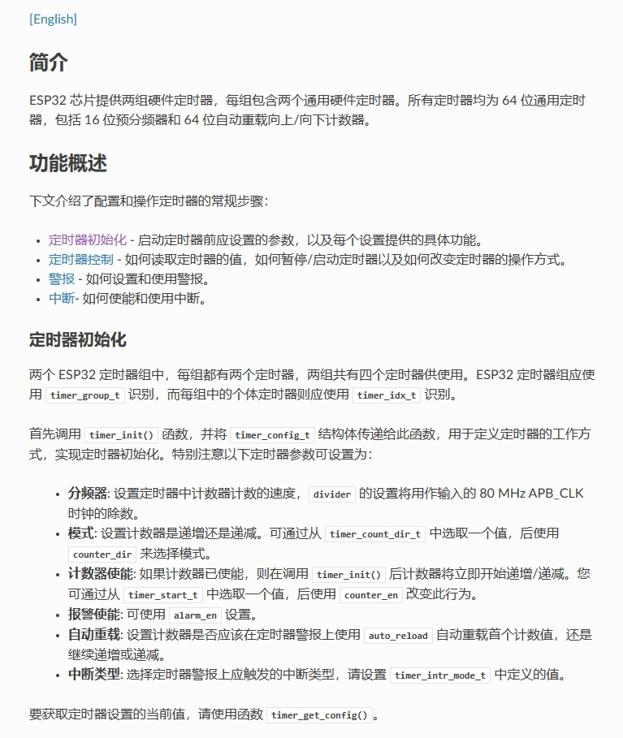

（由于任务量有点大，所以先不出英文版的了）

# 定时器专业版

这个部分我将会从51单片机定时器讲起，方便大家能够理解定时器的工作原理。并且可以了解使用寄存器编程和标准库函数编程中，我们每一步都干了什么事情。我只会介绍定时中断的操作。其他的模式可以类推。

## 51单片机的定时器

在这一部分，我们首先介绍51微控制器定时器的基本工作模式，并通过图示和流程图来清晰地展示每种模式的工作流程。我们将详细解释定时器的工作原理，以及如何通过寄存器配置来控制定时器的行为。

### 晶振

解释定时器的工作原理确实需要先理解晶振的概念。晶振是单片机系统中非常重要的组件，它为单片机提供了稳定的时钟信号。下面是关于晶振和定时器工作原理的基本介绍，我尽量保持简单明了以便于理解：

#### 晶振简介

晶振是一种电子振荡器电路，能产生特定、稳定的频率信号。在单片机系统中，晶振为单片机提供了一个基本的时钟脉冲，单片机内部所有的操作都是按照这个时钟脉冲来同步进行的。

#### 为什么需要晶振？

想象一下，如果没有钟表或者时间参考，我们无法准确地计算时间，也无法准确地安排事务。同样地，单片机也需要一个时间参考来执行指令、读写数据等。晶振就是提供这个时间参考的。

#### 晶振与单片机的关系

晶振产生的时钟脉冲会送到单片机的时钟输入端，单片机根据这个时钟脉冲来执行操作。每个时钟脉冲的来临，单片机执行一定的操作，比如执行一个指令或者更新一个寄存器的值。

### 定时器的工作原理

讲时钟信号传递给定时器，定时器并不会立刻工作，这是因为定时器需要正确的配置才能按照预期工作。首先第一个需要配置的就是工作模式。

#### 定时器的工作模式

1. 模式0（13位定时器/计数器模式）：
在这个模式下，定时器/计数器是一个13位的计数器。这意味着它可以计数从0到8191（2^13）的值。当它到达8191时，它会重置为0并产生一个中断。

2. 模式1（16位定时器/计数器模式）:
在这个模式下，定时器/计数器是一个16位的计数器。这意味着它可以计数从0到65535（2^16）的值。当它到达65535时，它会重置为0并产生一个中断。这是最常用的模式，因为它提供了较大的计数范围和较高的精度。

3. 模式2（8位自动重装模式）:
在这个模式下，定时器/计数器是一个8位的计数器，但是它有一个额外的“重装值”寄存器。每当定时器/计数器到达255时，它不是重置为0，而是重置为“重装值”寄存器中的值，并产生一个中断。

4. 模式3（两个8位定时器/计数器）:
说明：在这个模式下，定时器/计数器被分为两个独立的8位定时器/计数器。这样你可以同时进行两个独立的计数/计时任务。

了解清楚了51单片机定时器的工作模式，那么我们需要考虑如何配置它了。

#### 定时器/计数器工作模式寄存器TMOD(timer mode)
  
大家了解完上图就会发现，有M0,M1两位，没错，这两位就是设置工作模式的地方。由于模式1比较常用，所以我们以模式1来进行后面的讲解。

##### PS:  
这里需要解释一下寄存器编程。有的小朋友认为寄存器十分的难，其实不要害怕它。  
- 寄存器可以被比喻为一个房间，而这个房间有一个特定的地址（比如TMOD的地址是0x89）。每个房间都有它特定的功能和开关。
- 寄存器地址就像是房间的门牌号。例如，我们说“去TMOD房间”，在代码中就是访问地址0x89的寄存器。
- 寄存器中的位就像是房间里的开关，每个开关控制一个特定的功能。例如，在TMOD房间里，M1和M0开关控制定时器的工作模式。
- 操作寄存器就像是在房间里按开关。你可以打开或关闭开关来控制房间的功能。例如，要选择定时器的工作模式，你就需要在TMOD房间里按正确的开关。  

这样通过寄存器地址我们找到了对应的“房间”，然后通过设置寄存器中的位，就像是在房间里操作开关一样，来控制单片机的功能。

#### 定时器工作原理

上图为模式1工作时的结构图。定时器由4个部分组成：时钟源，运行控制，计数部件，溢出标志。
- 时钟源：图的左边上上半部分。由图可知，我们可以选择内部时钟（SYSclk），也可以选择外部时钟(T0 Pin)。这是通过TMOD中的另外
- 运行控制：图中下半部分。取决于TR0，GATE和外部控制引脚INT0。  
1. 当GATE = 0时，通过非门可得或门上面输入为1。   
根据或门逢1得1原则，或门输出为1。  
所以定时器是否启用取决于TR0的数值。TR0为0, control为0，开关断开，定时器失效。TR0为1，control为1， 开关导通，定时器启动。
2. 当GATE = 1时，通过非门可得或门上面输入为0.  
根据或门逢1得1原则，或门输出取决于INT0数值。  
由1.可得，定时器是否启用取决于TR0和INT0。只有TR0为1，INT0为1，control为1，开关导通，定时器有效。 
- 计数部件： 由TL0，TH0组成，是一个16为的加法计数器，对送来的脉冲进行基础，计数溢出后输出由低变高，设置溢出标志。
- 溢出标志： TF0。当计数部件移除后对其置1，向CPU请求中断。

那么我们知道了怎么配置我们需要的东西，但是我们如何让我们所想变为现实呢？

是否还记得我们TMOD还有两位。没错，另外两位就是干这个事情的。

这样我们就走通了我们的定时器的工作流程。定时器工作完，产生的数据放哪里呢？

#### 定时器/计数器工作控制寄存器TCON(timer control)

没错，他们被放在了这里。我们通过TCOM来完成数据记录和向主程序发送中断请求。

对了还忘记了最重要的，如何实现计时一秒。

#### 如何计时一秒 

在51单片机中，定时器的计数速度与单片机的晶振频率有关。通常，晶振频率为12MHz。但是，定时器不是直接以这个频率进行计数，而是以某个分频值的频率计数。分频器可以是12、4或1，由定时器模式和其他一些设置决定。

假设我们选择一个分频值为12的定时器模式（这是非常常见的），则定时器的计数频率将是12MHz/12 = 1MHz，即每微秒计数1。

为了实现1秒的延时，我们需要计数到1,000,000。但是，51单片机的定时器是16位的，最大计数值只能达到65535（即2^16 - 1）。因此，我们需要使用定时器溢出（也就是计数值从65535回滚到0）的特性。

1秒的延时可以通过以下步骤实现：

1. 设置定时器模式以及分频值（如果需要）。
2. 计算所需的初始计数值：初始计数值 = 65536 - (1,000,000 / 溢出次数)。如果我们选择溢出次数为20，那么初始计数值 = 65536 - (1,000,000 / 20) = 65536 - 50000 = 15536。
3. 将初始计数值加载到定时器的计数寄存器中。
4. 启动定时器。
监视定时器的溢出标志。每当定时器溢出时，清除溢出标志，并计数溢出次数。当溢出次数达到我们设定的值时（在这个例子中是20），1秒的延时完成。

### 51单片机定时器工作流程

通过上面的介绍，我们可以总结出下面的工作流程
1. 选择工作模式
~~~c
TMOD = 0x01;
~~~
2. 启动定时器
~~~c
TR0 = 1;
~~~
3. 设置定时值：使用TH（定时器高字节）和TL（定时器低字节）寄存器加载定时器的初始值。这个值决定了定时器溢出的时间。
~~~c
TH0 = 0xFF; // // Set the initial value for Timer 0 High Byte
TL0 = 0xFF; // Set the initial value for Timer 0 Low Byte
~~~
4. 检查和清除溢出标志
~~~c
if (TF0) 
{  // Check if Timer 0 has overflowed
    Timer0();
    TF0 = 0;  // Clear the overflow flag
}
~~~
5. 处理定时中断
~~~c
void Timer0() interrupt 1
{
    // 处理定时中断
}
~~~

### 练习
通过刚才的学习，我希望你能看懂这个代码
~~~c
#include <reg51.h>  // 包含头文件，定义了51单片机的寄存器

void delay_1_second(void);  // 函数声明

void main() {
    while(1) {
        delay_1_second();  // 调用函数，实现1秒的延时
        // ... 其他代码
    }
}

void delay_1_second(void) {
    unsigned char i;
    TMOD = 0x01;  // 设置定时器0为模式1，16位定时器
    for(i = 0; i < 20; i++) {  // 溢出20次
        TH0 = (65536 - 50000) / 256;  // 设置定时器初始值的高字节
        TL0 = (65536 - 50000) % 256;  // 设置定时器初始值的低字节
        TF0 = 0;  // 清除溢出标志
        TR0 = 1;  // 启动定时器
        while(!TF0);  // 等待定时器溢出
        TR0 = 0;  // 停止定时器
    }
}
~~~ 

定时器的计数
每接收到一个时钟脉冲，定时器的计数值就会增加1。例如，在模式1下，定时器T0和T1是16位的，它们从0开始计数，每个时钟脉冲使它们的计数值增加1，直到它们溢出（从0xFFFF变为0x0000），然后定时器再次从0开始计数。

定时器的溢出和中断
当定时器的计数值溢出时，它会产生一个中断。中断是单片机的一种机制，它暂停当前的任务，转而去处理一个更紧急的任务。在这种情况下，处理定时器溢出的中断服务程序会被执行。

## STM32的定时器

我们这里简单介绍一下思路，帮助大家理解库函数编程。

### 时钟树
STM32的时钟信号也是晶振提供。但是STM32的功能比51更多，所以各个功能需要的时钟信号也不同。因此STM32使用了时钟树来解决这个问题。

这个图可能看上去很头疼，但是我们抽丝剥茧一下。我们的基础定时器是TIM6。所以这个是时钟图可以简化成这样子

我们选用8Mhz是因为其稳定。调节各个环节的数值可以得到我们想要的时钟频率（72MHz）。这个过程基本上在写项目的时候自动生成，例如你使用了STM32CubeMX或类似的工具来生成初始化代码，那么时钟配置代码通常会在一个名为SystemClock_Config的函数中，你可以在生成的main.c文件中找到这个函数，并确保它被正确调用了。

### STM32定时器工作流程
我们要了解工作流程，我们需要先看定时器框图

我们可以看到我们需要配置预分频器，计数方式，自动重载值。  
所以标准库给了我们提供了函数来让我们配置定时器：  
1. RCC_APB1PeriphClockCmd(RCC_APB1Periph_TIM6, ENABLE):  
此函数用于使能（ENABLE）或禁用（DISABLE）APB1总线上特定外设的时钟。在这里，它被用于使能TIM6定时器的时钟。
2. TIM_TimeBaseInitTypeDef TIM_TimeBaseStructure:  
这是一个用于初始化TIM基础定时器的结构体，其中包含了定时器的配置参数。  
3. TIM_TimeBaseStructure.TIM_Period = 9999:  
TIM_Period字段设置了定时器的自动重装载值。当定时器计数值达到这个值时，它会自动重置到0，并产生一个更新事件（也就是产生中断，如果中断使能的话）。  
4. TIM_TimeBaseStructure.TIM_Prescaler = 8399:  
TIM_Prescaler字段设置了定时器的预分频值。这会减慢定时器计数的速度。具体的预分频系数是TIM_Prescaler + 1，所以这里实际的预分频系数是8400。  
5. TIM_TimeBaseStructure.TIM_ClockDivision = TIM_CKD_DIV1:  
TIM_ClockDivision字段设置了进一步的时钟分频。在这里，它被设置为不进行额外的分频。  
6. TIM_TimeBaseStructure.TIM_CounterMode = TIM_CounterMode_Up:  
TIM_CounterMode字段设置了定时器的计数模式。在这里，它被设置为向上计数模式。  
7. TIM_TimeBaseInit(TIM6, &TIM_TimeBaseStructure):  
此函数根据TIM_TimeBaseStructure结构体的参数配置TIM6定时器的时基（Time Base）。
8. TIM_ITConfig(TIM6, TIM_IT_Update, ENABLE):  
此函数用于使能或禁用指定定时器的中断。在这里，它被用于使能TIM6的更新中断。  
9. TIM_Cmd(TIM6, ENABLE):  
此函数用于启动或停止指定的定时器。在这里，它被用于启动TIM6定时器。

总结一下我们就可以得到下面这张图

### 练习
了解了上面的知识，我希望你能看得懂下面的代码
~~~c
#include "stm32f4xx.h"
#include "stm32f4xx_tim.h"
#include "stm32f4xx_rcc.h"

void TIM6_DAC_IRQHandler(void);

int main(void)
{
  // 系统时钟初始化
  SystemInit();
  
  // TIM6时钟使能
  RCC_APB1PeriphClockCmd(RCC_APB1Periph_TIM6, ENABLE);
  
  // TIM6基础定时器配置
  TIM_TimeBaseInitTypeDef TIM_TimeBaseStructure;
  TIM_TimeBaseStructure.TIM_Period = 9999;  // 自动重装载值
  TIM_TimeBaseStructure.TIM_Prescaler = 8399;  // 预分频值
  TIM_TimeBaseStructure.TIM_ClockDivision = TIM_CKD_DIV1;  // 时钟分频因子
  TIM_TimeBaseStructure.TIM_CounterMode = TIM_CounterMode_Up;  // 计数模式
  TIM_TimeBaseInit(TIM6, &TIM_TimeBaseStructure);
  
  // 使能TIM6更新中断
  TIM_ITConfig(TIM6, TIM_IT_Update, ENABLE);
  
  // 配置TIM6中断
  NVIC_InitTypeDef NVIC_InitStructure;
  NVIC_InitStructure.NVIC_IRQChannel = TIM6_DAC_IRQn;
  NVIC_InitStructure.NVIC_IRQChannelPreemptionPriority = 0;
  NVIC_InitStructure.NVIC_IRQChannelSubPriority = 1;
  NVIC_InitStructure.NVIC_IRQChannelCmd = ENABLE;
  NVIC_Init(&NVIC_InitStructure);
  
  // 启动TIM6
  TIM_Cmd(TIM6, ENABLE);
  
  while (1)
  {
    // 主循环
  }
}

// TIM6中断服务程序
void TIM6_DAC_IRQHandler(void)
{
  if(TIM_GetITStatus(TIM6, TIM_IT_Update) != RESET)  // 检查TIM6更新中断发生与否
  {
    TIM_ClearITPendingBit(TIM6, TIM_IT_Update);  // 清除TIM6更新中断标志
    // 这里可以执行每秒需要完成的任务
  }
}
~~~

## ESP32的定时器
了解完STM32的定时器，我们再回过来看基础版的代码
~~~c
/*
 * @description : 初始化指定的定时器，并配置其基本参数
 *
 * @param : timer_idx - 要初始化的定时器编号
 * @param : auto_reload - 定时器到达警报值时是否自动重装
 * @param : timer_interval_sec - 要设置的警报间隔
 *
 * @return : 无
 */
static void tg0_timer_init(int timer_idx, bool auto_reload, double timer_interval_sec)
{
    // 定义定时器的配置结构体
    timer_config_t config = {
        .divider = TIMER_DIVIDER,                           // 计数器时钟分频器。分频器的范围从 2 到 65536
        .counter_dir = TIMER_COUNT_UP,                      // 设置计数器递增
        .counter_en = TIMER_PAUSE,                          // 计数器使能
        .alarm_en = TIMER_ALARM_EN,                         // 定时器报警使能
        .auto_reload = auto_reload,                         // 定时器自动重新加载
    };

    // 使用上面的配置初始化定时器
    timer_init (TIMER_GROUP_0, timer_idx, &config);

    // 定时器的计数器将从下面的值开始
    // 此外，如果设置了auto_reload，这个值将在警报时自动重载
    timer_set_counter_value(TIMER_GROUP_0, timer_idx, 0x00000000ULL);

    // 配置警报值和警报中断
    // TIMER_SCALE 是一个宏，用于将秒转换为定时器的内部计数单位
    timer_set_alarm_value (TIMER_GROUP_0, timer_idx, timer_interval_sec * TIMER_SCALE);

    // 使能定时器的中断
    timer_enable_intr (TIMER_GROUP_0, timer_idx);

    // 为定时器注册一个中断服务例程
    // timer_group0_isr 是中断服务例程的函数地址
    // ESP_INTR_FLAG_IRAM 是中断的属性标志
    timer_isr_register(TIMER_GROUP_0, timer_idx, timer_group0_isr, (void *) timer_idx, ESP_INTR_FLAG_IRAM, NULL);

    // 启动定时器
    timer_start(TIMER_GROUP_0, timer_idx);
}
~~~
其实过程是一样的，只不过函数名字不一样罢了。我们可以通过查看官方手册的方式来找到我们到底怎么配置定时器

希望你通过这一节能够看得懂工作流程图，了解寄存器编程和库函数编程的使用。希望你在接下来的学习中越来越好

